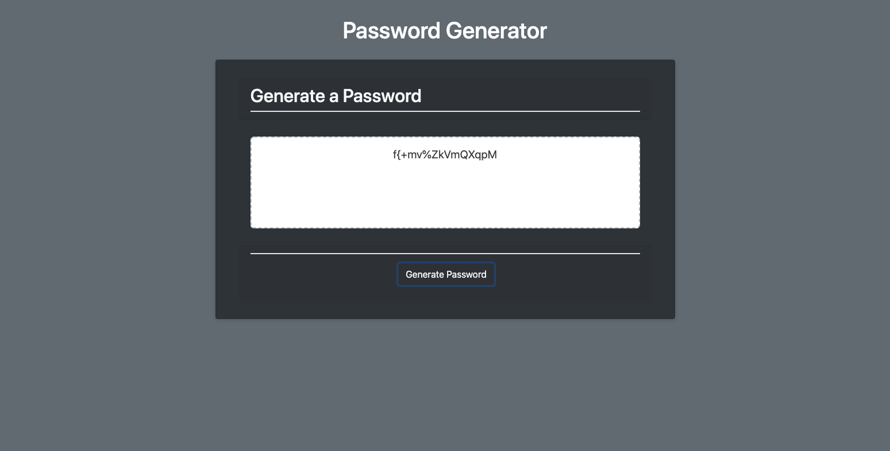

# Password-Generator
A password generator for a user that needs a simple or complex password that is powered with JavaScript 
This program will start once the user clicks the button and will ask the user to choose a number between 8 and 128 for the charachter length of the password
Once the user has choose the lenght they will be shown a sereis  of prompts about the type of characters they would like to include in their password
After the data is inputed it will genertate a raddome password with the characters the user wanted.
This is all happeing once the user clicks the button which then calls on the function to do the rest

# Link to working application: http://127.0.0.1:5500/index.html

